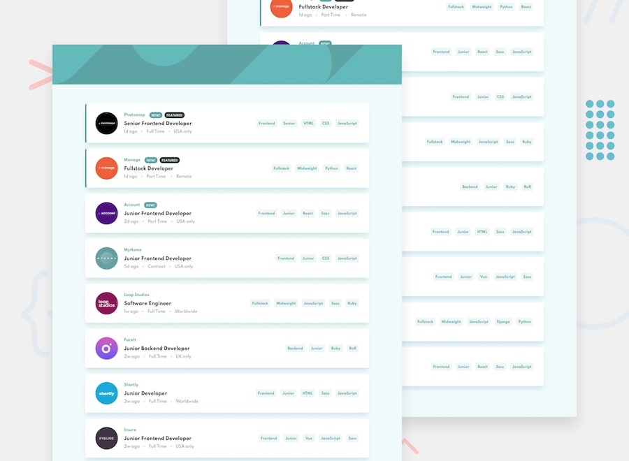
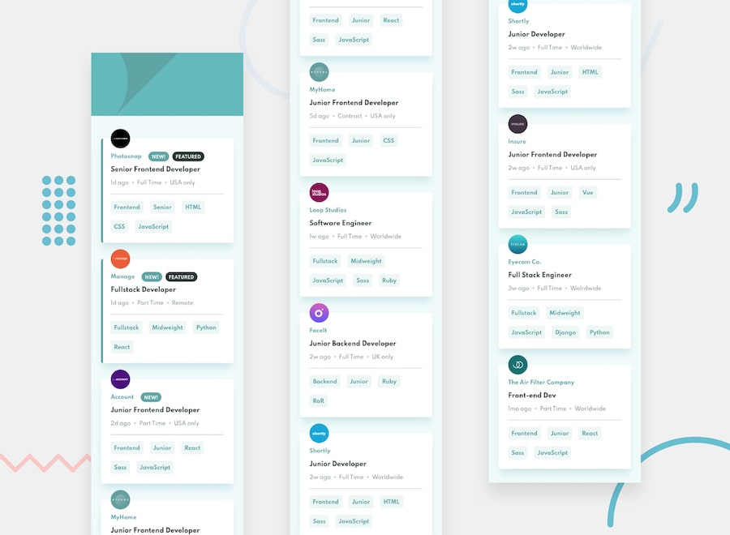
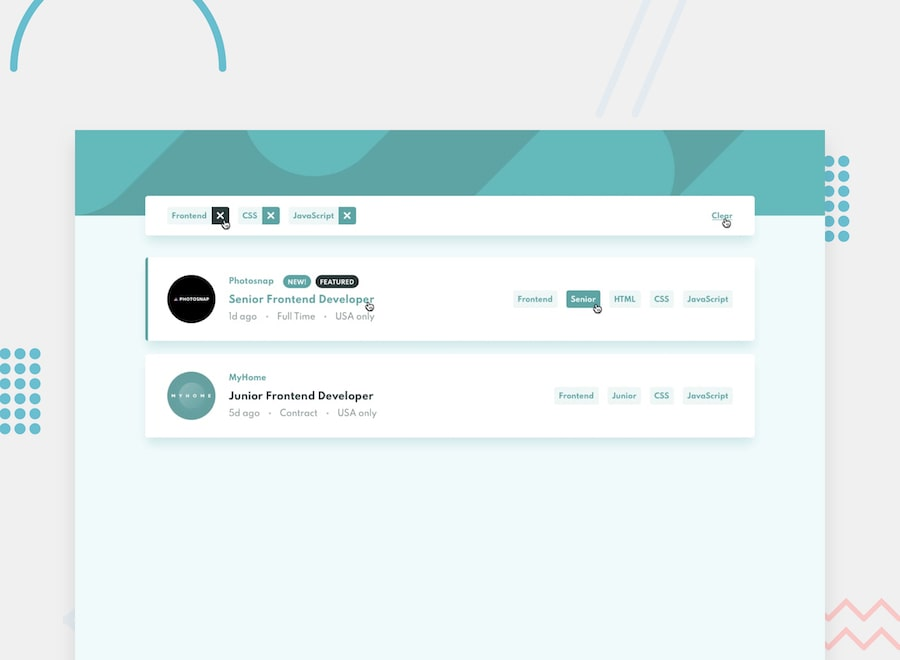

<h1 align="center">
    
</h1>

  

  

  

  

  <a href="#-project">Project</a>&nbsp;&nbsp;&nbsp;|&nbsp;&nbsp;&nbsp;
  <a href="#rocket-Technologies">Technologies</a>&nbsp;&nbsp;&nbsp;|&nbsp;&nbsp;&nbsp;
  <a href="#-layout">Layout</a>&nbsp;&nbsp;&nbsp;|&nbsp;&nbsp;&nbsp;
  <a href="#-api">API</a>&nbsp;&nbsp;&nbsp;|&nbsp;&nbsp;&nbsp;

## 💻 Project

My challenge was to build out this job offer landing page with the optimal layout depending on user device's screen size and use filter to list jobs based on the categories selected.

See the challenge here: https://www.frontendmentor.io/challenges/job-listings-with-filtering-ivstIPCt

## :rocket: Technologies

This project was developed with the following technologies:

- [React][reactjs]
- [Sass][sass]

## 🔖 Layout

<h1 align="center">
    
    
    
</h1>
## API

https://api.jsonbin.io/b/5e8884988841e979d0fd84ed/5

Made with ♥ by Isaque Igor :wave: [Get in touch!](https://www.linkedin.com/in/isaqueigor/)

[nodejs]: https://nodejs.org/
[sass]: https://sass-lang.com/
[typescript]: https://www.typescriptlang.org/
[expo]: https://expo.io/
[reactjs]: https://reactjs.org
[rn]: https://facebook.github.io/react-native/
[yarn]: https://yarnpkg.com/
[vs]: https://code.visualstudio.com/
[vceditconfig]: https://marketplace.visualstudio.com/items?itemName=EditorConfig.EditorConfig
[vceslint]: https://marketplace.visualstudio.com/items?itemName=dbaeumer.vscode-eslint
[prettier]: https://marketplace.visualstudio.com/items?itemName=esbenp.prettier-vscode
